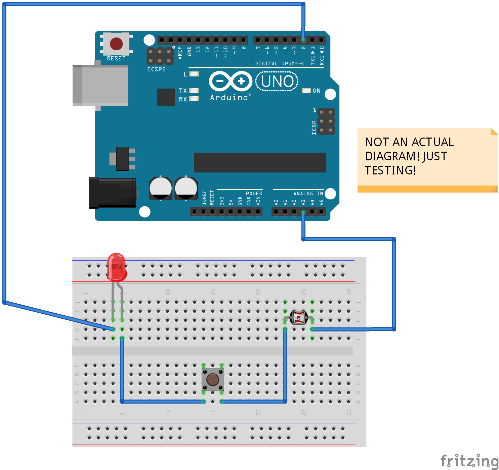
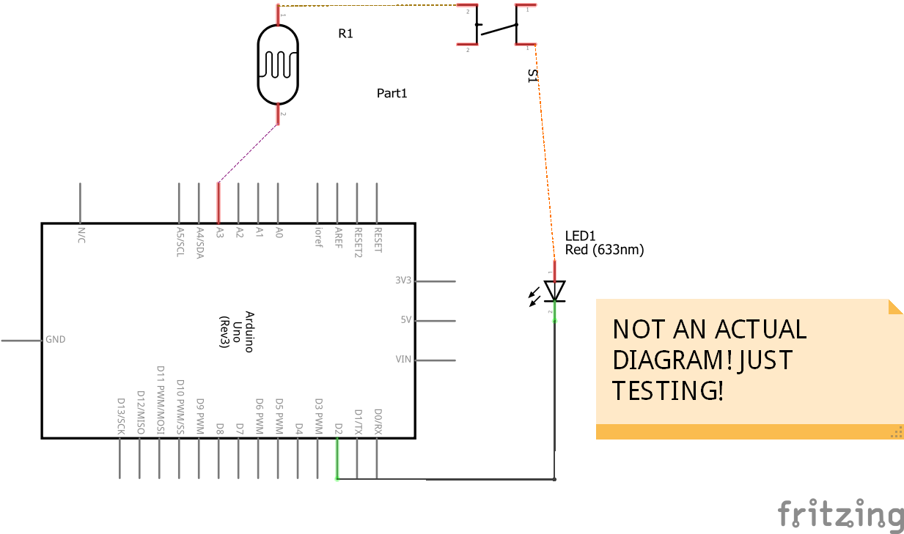

Calico Home Security
====================


<sub>(_Image courtesy of [pixabay](https://pixabay.com/en/laser-optics-science-laser-pointer-160991/)_)</sub>

The **Calico Home Security System** is a home security platform to detect and react to intruders. It is an _extensible_ system with multiple _modules_ available to be added to it.


Table of Contents
=================

- [Documentation](#documentation)
  * [Hardware](#hardware)
- [Development](#development)
  * [IDE / Dev Environment Setup Instructions](#ide--dev-environment-setup-instructions)
    + [Which IDE for Arduino Development?](#which-ide-for-arduino-development-)
    + [IDE Setup Instructions](#ide-setup-instructions)
    + [(Windows Only) Install Clang](#windows-only-install-clang)
    + [Run a "Blink" program on your Arduino Uno](#run-a-blink-program-on-your-arduino-uno)
    + [(Optional) Git Atom Package Setup Instructions](#optional-git-atom-package-setup-instructions)
    + [(Optional) GitKraken Git GUI Client](#optional-gitkraken-git-gui-client)
    + [Clone the GitHub Repository](#clone-the-github-repository)
  * [Compile Instructions](#compile-instructions)
  * [Deploy Instructions](#deploy-instructions)
- [Wiring Diagrams / Schematics](#wiring-diagrams--schematics)
- [Authors](#authors)

<sub>Table of contents generated with <a href='http://ecotrust-canada.github.io/markdown-toc/'>markdown-toc</a></sub>

Documentation
=============

Hardware
--------

* [Arduino Uno](https://www.arduino.cc/en/Main/ArduinoBoardUno)
* Ordinary Red Laser Pointer
* Photoresistor
* Piezo Buzzer
* Various Wires and Miscellaneous Odds & Ends


Development
===========

IDE / Dev Environment Setup Instructions
----------------------------------------

### Which IDE for Arduino Development?

We've chosen to use **[PlatformIO](http://platformio.org/)** as our IDE. We chose this above using the main [Arduino IDE](https://www.arduino.cc/en/Main/Software) for a number of reasons:

1. The Arduino IDE is quite _'barebones'_. It does not support nice features like auto-complete or code linting. PlatformIO does out of the box.
2. PlatformIO is built on the popular [Atom](https://atom.io/) text editor. The community behind Atom has _many_ plugins for various code formats, styles, themes, etc.1
3. Arduino IDE doesn't have Git Plugin support. Because PlatformIO is built on Atom, the ability to use a Git Plugin was just a few clicks away. _(Sure - we could have used Git from the commandline, but we wanted to simplify our workflow as much as possible.)_
4. We knew coming in that we would likely be pulling in additional libraries for this project. Arduino IDE doesn't manage those for you. PlatformIO does out of the box.
5. PlatformIO is not only an IDE but a 'framework' which can be integrated into other IDEs such as Eclipse, CLion, Visual Studio, Netbeans, VIM, Emacs, Codeanywhere, and several others. This appealed to us because it gave the ability for a PlatformIO project to be built, run, uploaded, etc. using many development platforms.
6. Both the Arduino IDE and PlatformIO were supported on multiple platforms and were relatively self-contained which we wanted.

Some other IDEs considered:

1. [Sloeber](http://eclipse.baeyens.it/index.shtml) _(Prepackaged, Eclipse-based IDE.)_
2. [CLion](https://www.jetbrains.com/clion/)
3. [Programino](http://www.programino.com/) _(Offers a pretty neat feature which displays your Arduino board's pinouts and specs right in the IDE)_

### IDE Setup Instructions

1. Ensure that a recent version of Python 2.X is installed
	* Most platforms, except [Windows](https://www.python.org/downloads/windows/), will likely have this preinstalled.
2. [Download](http://platformio.org/platformio-ide) the PlatformIO IDE for your platform
3. Run the installer. PlatformIO will install Atom then launch it.
	* Note - if you already have Atom installed it will launch the existing Atom instance you have installed and install itself as a plugin
4. Wait for installation to complete. When prompted, restart Atom.

### (Windows Only) Install Clang
Clang is what PlatformIO uses for the Intelligent Code Autocompletion. It comes installed on some platforms but not on Windows. Other platforms may also need to install it. You can find all the platform instructions (here)[http://docs.platformio.org/en/latest/ide/atom.html#ide-atom-installation-clang].

1. Navigate to the (Clang Download)[http://llvm.org/releases/download.html] page.
2. Under the `Pre-Built` Binaries section, choose the (Clang for Windows (64-bit))[http://releases.llvm.org/3.9.1/LLVM-3.9.1-win64.exe] option to download it
3. Follow the install prompts. Make sure that you choose the `Add LLVM to the system PATH for all users` option while installing.
	* Note - if you see `Failed to find MSBuild toolsets directory` error in the installation console, please ignore it and press any key to close this window. PlatformIO IDE uses only Clang completion engine that should work after it without any problems.
4. You will need to restart PlatformIO / Atom if it was already running

### Run a "Blink" program on your Arduino Uno
This step will make sure that PlatformIO is full installed and configured properly. These are almost the exact steps provided by PlatformIO in their (quick start)[http://docs.platformio.org/en/latest/ide/atom.html#quick-start] guide. UIt also includes screenshots so if you are having difficulties with any of these steps refer to it to help you along.

1. From the PlatformIO 'Home' page...
2. Click the `+ New Project` button
3. Click the `Selected board` dropdown and choose Arduino --> Arduino Uno
4. Next to the `Choose the directory` dropdown click the `other` button to browse to a location where you want the code to reside
	* I would choose a temporary location as this will only be really run once to make sure everything is configured
5. Click the `Process` button
6. Wait for the "Installing platform: atm..." message to go away and for the new project to be created
7. Right-click on the `src` folder and choose `New file`
8. Enter `src\main.cpp` in the dialog box that appears
9. Hit your Enter key
	* Note - on Windows and some other platforms it is at this point that PlatformIO will recognize you don't have "Clang" installed if you didn't follow the install instructions above. If this happens, follow the `Install Clang` instructions above.
10. In main.cpp past in the following code:
	```cpp
	/**
	 * Blink
	 *
	 * Turns on an LED on for one second,
	 * then off for one second, repeatedly.
	 */
	#include "Arduino.h"

	#ifndef LED_BUILTIN
	#define LED_BUILTIN 13
	#endif

	void setup()
	{
	  // initialize LED digital pin as an output.
	  pinMode(LED_BUILTIN, OUTPUT);
	}

	void loop()
	{
	  // turn the LED on (HIGH is the voltage level)
	  digitalWrite(LED_BUILTIN, HIGH);

	  // wait for a second
	  delay(1000);

	  // turn the LED off by making the voltage LOW
	  digitalWrite(LED_BUILTIN, LOW);

	   // wait for a second
	  delay(1000);
	}
	```
11. Build the project by either clicking the `PlatformIO --> Build` menu option, clicking in the lower left on the `PlatformIO: Build` button, or clicking the `checkmark` icon on the left of the screen.
	* If prompted, click the `Save and build` option
12. You should see a console window appear. It will compile several things. Wait for this to complete.
13. Eventually you should see a `SUCCESS` message
14. Plug in your Arduino Uno
16. Upload the project by either clicking the `PlatformIO --> Upload` menu option or click the right-facing `arrow` icon on the left of the screen.
17. A console window will appear. It will do several things and then upload the code to your Arduino. On the Arduino you should see multiple LEDs light up when the program is being uploaded.
18. The LED on your Arduino board should turn on then off in 1-second intervals
	* Note - This "Blink" program comes preinstalled on many boards so it may start blinking right when you first plug it in. TO make sure you've uploaded a new program correctly I'd suggest changing the delay amounts to something other than 1-second each then reuploading it. This way you know for sure it is your code that is runnin on it.
19. Congratulations! You've hit a milestone - you've created your first PlatformIO application as well as run it on your Arduino! If you encountered any issues then they need to be address at this point before continuing on.

### (Optional) Git Atom Package Setup Instructions
Ensure that you have a recent version of [Git](https://git-scm.com/downloads) installed before following these instructions.

1. In Atom...
2. File --> Settings
3. Select the Install tab
4. In the Search packages box type "git-plus". Press Enter to search.
5. Locate "git-plus" _(the correct one should have >1Million installs)_ and click the Install button
	* Note - it may show that there is a later version than the one that is supported by this version of Atom. Thats ok - just install the version which is available.
6. Click the Packages menu item. Git Plus should be listed.
7. Close the Setting tab

### (Optional) GitKraken Git GUI Client
If you would like to use a Git GUI Client I'd recommend **[GitKraken](https://www.gitkraken.com/)**. It is pretty much awesome!

There are other Git GUI clients out there such as [SmartGit](http://www.syntevo.com/smartgit/) or Github's own [GitHub Desktop](https://desktop.github.com/) which do a great job to help you interact with Git, but GitKraken just takes a different approach from these. The visuals, the drag-and-drop to commit, the overall interface just feel nice. No specific instructions are provided for any of these.

### Clone the GitHub Repository

1. From the command line...
2. Navigate to the directory where you would like the project to reside
3. Issue the following Git command:
	```
	git clone https://github.com/Lastrellik/Calico-Home-Security.git
	```
4. Launch PlatformIO
5. Click the "Open Project" button on the PlatformIO Home tab
6. Browse to the directory where you checked out the Repository
7. Click the Select Folder button
8. Congratulation! You are now ready to begin development on the Calico Home Security System!


Compile Instructions
--------------------

1. asdf
2. asdf

Deploy Instructions
-------------------

1. asdf
2. asdf


Wiring Diagrams / Schematics
============================
** These are only EXAMPLES!** Don't actually build these yet. These are just placeholders for future diagrams as we make them.


<sub>(_The Base Wiring Diagram for the Calico Home Security System_)</sub>


<sub>(_The Base Wiring Schematic for the Calico Home Security System_)</sub>


Authors
=======

* Christopher Nash
* Tyler Jacobs
* Dave Tille
* Jason Bruderer

This project was created as an assignment for our CSIS 2810 Computer Architecture course.
