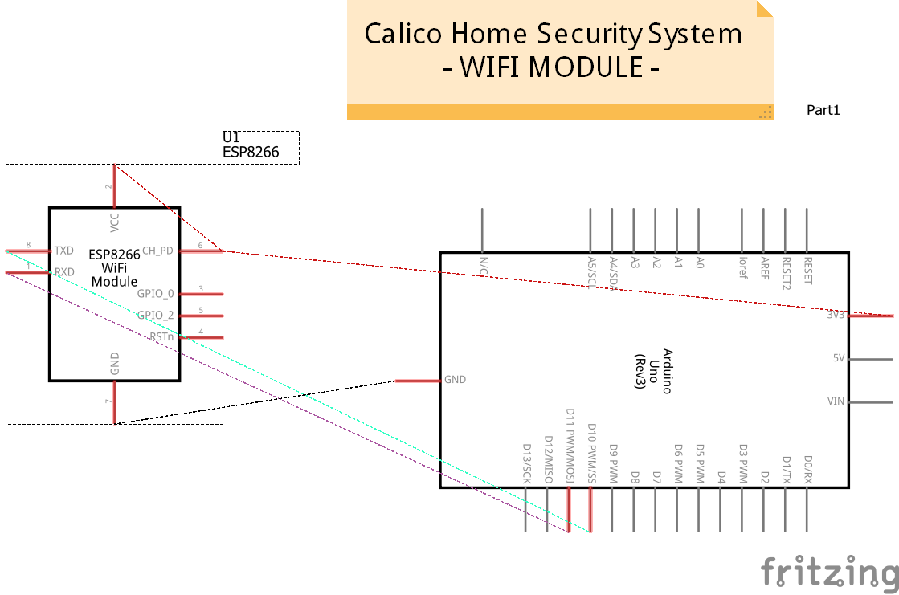

The WIFI Module
===============

The WIFI Module uses an [ESP8266] to add wireless functionality to the Calico Home Security System.
This wireless functionality allows you to be notified when the alarm is triggered.

Parts
-----
* ESP8266 - ESP-01
  - [Ebay](http://www.ebay.com/sch/i.html?_from=R40&_sacat=0&_nkw=esp8266%20esp-01&rt=nc&LH_PrefLoc=1&_trksid=p2045573.m1684): ~$5-7
    - Make sure you see where they are being shipped from. Many of these come from China so you'll be waiting weeks and weeks to get one...
  - [AliExpress](https://www.aliexpress.com/wholesale?catId=0&initiative_id=SB_20170302204802&SearchText=esp8266+esp-01): ~$1.50-$2
    - If you are strapped for cash and have some time to wait to get them, you can buy them from sellers in China directly and save a few dollars.
  - Note that getting one with a "Breadboard Adapter" can be helpful for prototyping as the ESP-01 won't fit into a breadboard without it.
  - Also note that there are _many_ different models that contain as ESP8266 (esp-01, esp-07, esp-12, esp-12E, esp-12F, NodeMCU, etc.). Make sure you purchase an "ESP-01" model. The ESP-01 model was a very commonly used one and had a small profile so I decided to go with it. In theory any of the other models would work as well though no instructions, wiring diagrams, or code are provided here.

Bread Board Diagram
-------------------

<sub>(_The WIFI Module Wiring Diagram for the Calico Home Security System_)</sub>


Schematic Diagram
-----------------

<sub>(_The WIFI Module Wiring Schematic for the Calico Home Security System_)</sub>


Setup
=====
The ESP8266 needs a few steps before it can be ready to communicate with the Arduino.

**ONLY ROUGH STEPS! Need to formalize these more**


Set ESP8266's Baud Rate to 9600
-------------------------------

Only need to do this once. This setting is persisted on the ESP-01.

Run the following code:

```
#include "Arduino.h"
#include <SoftwareSerial.h>

SoftwareSerial esp8266(10,11);

void setup(){
  Serial.begin(115200);
  while (!Serial) { }
  esp8266.begin(115200);
}

void loop(){
  esp8266.listen();
  if (esp8266.available() ) {
    Serial.write(esp8266.read());
  }

  if (Serial.available() ){
    esp8266.write(Serial.read());
  }
  delay(10);
}
```

Launch the Serial Terminal - make sure baud rate is set to `115200`
Type "AT" and press Enter.
  Should get an "OK" response
Type `AT+UART_DEF=9600,8,1,0,0`
  Will see characters moving but will just be garbled.

Change `115200` to `9600`
Build and upload
Launch the Serial Terminal - make sure baud rate is set to `9600`
Type "AT" and press Enter.
  Should get an "OK" response


Make Sure Arduino and ESP8266 can communicate with each other
-------------------------------------------------------------

Build and upload this code:
```
#include "Arduino.h"
#include <SoftwareSerial.h>

SoftwareSerial esp8266(10,11);

void setup() {
  Serial.begin(9600);
  esp8266.begin(9600);
  delay(1000); // Let the module self-initialize
}

void loop() {
  delay(5000);
  Serial.println("Sending an AT command...");
  esp8266.println("AT");
  delay(100);
  while (esp8266.available()){
     String inData = esp8266.readStringUntil('\n');
     Serial.println("Got response from ESP8266: " + inData);
  }
}
```

Launch terminal
You should see output like this every 5 seconds
```
Sending an AT command...
Got response from ESP8266: AT
Got response from ESP8266:
Got response from ESP8266: OK
```

In Case Of Emergency
====================

Long story... Be careful what commands you run... Don't EVER run ``

Stored firmware in project.

esptool.py
